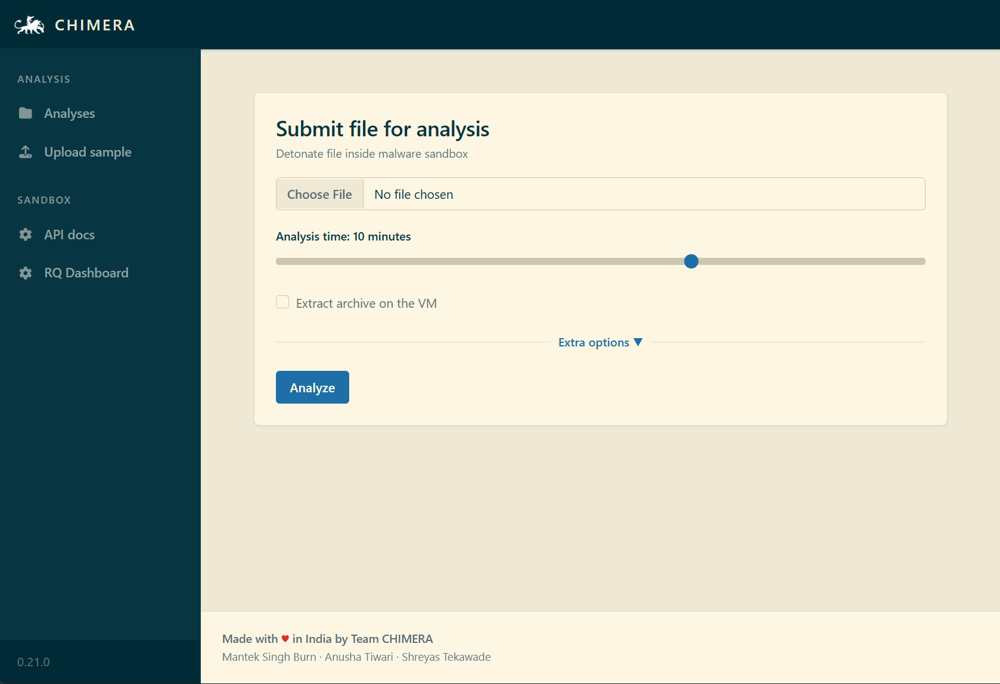

# CHIMERA

> [!WARNING]  
> Here be dragons 🐉. Maintaining your own sandbox is a difficult task and this project uses technology that is not user-friendly.
> Be prepared to brush up on your debugging skills as bugs may be reproducible only on your configuration.
> On the other hand, it's not purely an R&D project and it is used in production! Source code and issues section on both
> CHIMERA and the [DRAKVUF engine](https://github.com/tklengyel/drakvuf) are your best friends.

CHIMERA is an automated black-box malware analysis platform powered by the [DRAKVUF](https://drakvuf.com/) engine, which does not require an agent on the guest OS.

This project provides you with a friendly web interface that allows you to upload suspicious files to be analyzed. Once the sandboxing job is finished, you can explore the analysis result through the mentioned interface and get an insight on whether the file is truly malicious or not.

Because it is usually pretty hard to set up a malware sandbox, this project also provides you with an installer app that would guide you through the necessary steps and configure your system using settings that are recommended for beginners. At the same time, experienced users can tweak some settings or even replace some infrastructure parts to better suit their needs.

## Quick start
* **[👋 Getting started](https://drakvuf-sandbox.readthedocs.io/en/latest/usage/getting_started.html)**
* [Latest releases](https://github.com/CERT-Polska/drakvuf-sandbox/releases)
* [Latest docs](https://drakvuf-sandbox.readthedocs.io/en/latest/)

## Recommended hardware & software

In order to run CHIMERA, your setup should fulfill all the listed requirements.

* Processor:
  * ✔️ Required Intel processor with Intel Virtualization Technology (VT-x) and Extended Page Tables (EPT) features
* Host system with at least 2 core CPU and 5 GB RAM, running GRUB as bootloader, one of:
  * ✔️ Debian 12 Bookworm
  * ✔️ Ubuntu 22.04 Jammy
* Guest system, one of:
  * ✔️ Windows 10 build at least 2004 (x64), recommended 22H2
  * ✔️ Windows 7 (x64)

Nested virtualization:

* ✔️ Xen - works out of the box.
* ✔️ KVM - works, we often use it for development purposes. If you experience any bugs, please report them to us for further investigation.
* ✔️ VMware Workstation Player - works, but you need to check Virtualize EPT option for a VM; Intel processor with EPT still required.
* ❌ AWS, GCP, Azure - due to lack of exposed CPU features, hosting CHIMERA in the cloud is **not** supported (although it might change in the future).
* ❌ Hyper-V - doesn't work.
* ❌ VMWare Fusion (Mac) - doesn't work.

## Maintainers/authors

Feel free to contact us if you have any questions or comments.

This project is authored by:

* Mantek Singh Burn ([@clustercoder](https://github.com/clustercoder))
* Anusha Tiwari ([@anushatiwari27](https://github.com/anushatiwari27))
* Shreyas Tekawade ([@ShreyasTek1](https://github.com/ShreyasTek1))

If you have any questions about [DRAKVUF](https://drakvuf.com/) engine itself, contact tamas@tklengyel.com
